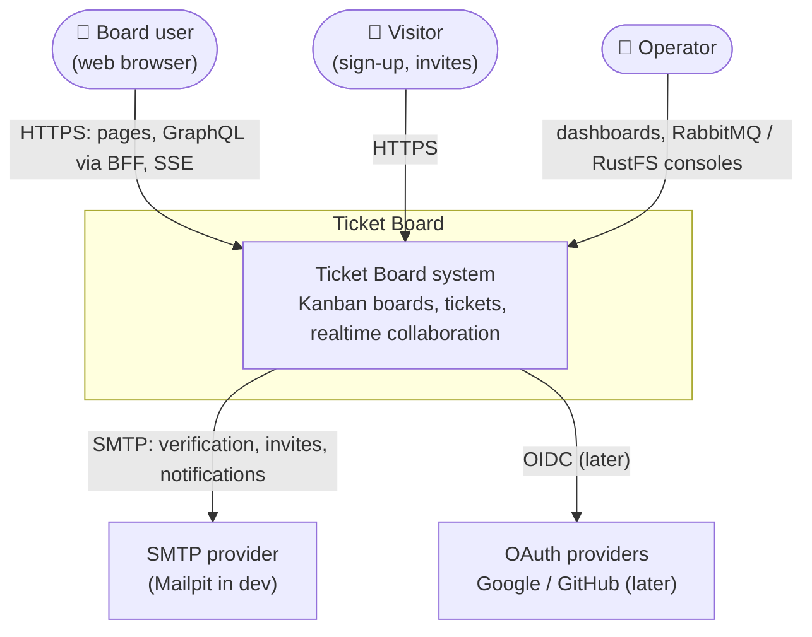

# Architecture · System context (C4 level 1)

> Index: [04 · Architecture §1](../../04-architecture.md#1-system-context-c4-level-1)

```mermaid
flowchart TB
  user(["👤 Board user<br/>(web browser)"])
  visitor(["👤 Visitor<br/>(sign-up, invites)"])
  ops(["👤 Operator"])

  subgraph TB["Ticket Board"]
    sys["Ticket Board system<br/>Kanban boards, tickets, realtime collaboration"]
  end

  smtp["SMTP provider<br/>(Mailpit in dev)"]
  oauth["OAuth providers<br/>Google / GitHub (later)"]

  user -- "HTTPS: pages, GraphQL via BFF, SSE" --> sys
  visitor -- "HTTPS" --> sys
  ops -- "dashboards, RabbitMQ / RustFS consoles" --> sys
  sys -- "SMTP: verification, invites, notifications" --> smtp
  sys -- "OIDC (later)" --> oauth
```
