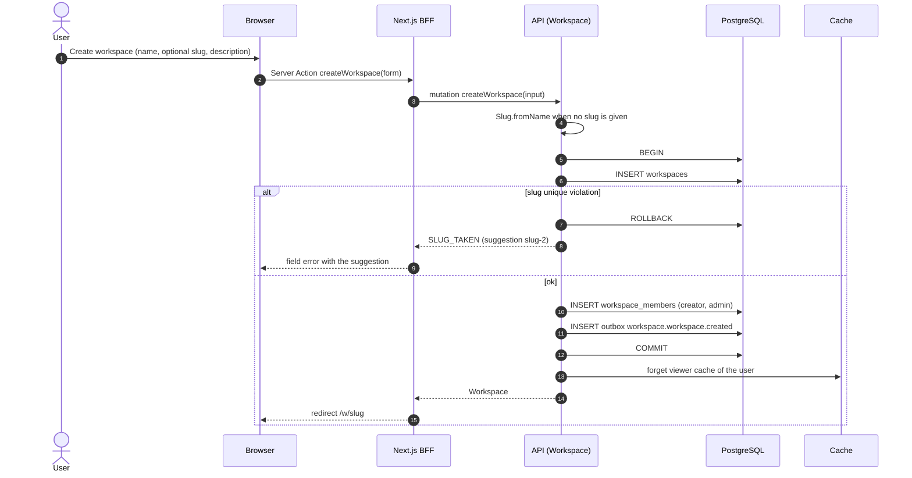

# Sequence 06 · Create workspace

> Index: [07 · Sequence flows](../../07-sequence-flows.md) · Use case: [Workspace](../use-case/02-workspace.md) · Class: [Workspace](../class/03-workspace.md)

```mermaid
sequenceDiagram
  autonumber
  actor U as User
  participant B as Browser
  participant N as Next.js BFF
  participant A as API (Workspace)
  participant DB as PostgreSQL
  participant C as Cache

  U->>B: Create workspace (name, optional slug, description)
  B->>N: Server Action createWorkspace(form)
  N->>A: mutation createWorkspace(input)
  A->>A: Slug.fromName when no slug is given
  A->>DB: BEGIN
  A->>DB: INSERT workspaces
  alt slug unique violation
    A->>DB: ROLLBACK
    A-->>N: SLUG_TAKEN (suggestion slug-2)
    N-->>B: field error with the suggestion
  else ok
    A->>DB: INSERT workspace_members (creator, admin)
    A->>DB: INSERT outbox workspace.workspace.created
    A->>DB: COMMIT
    A->>C: forget viewer cache of the user
    A-->>N: Workspace
    N-->>B: redirect /w/slug
  end
```
